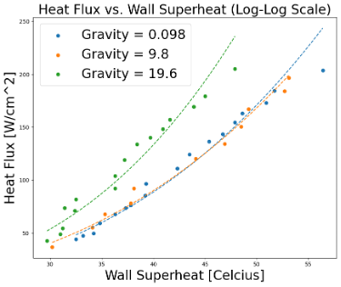
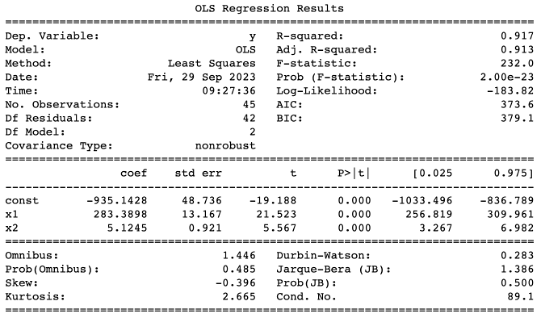
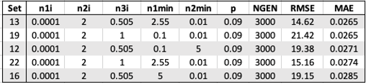
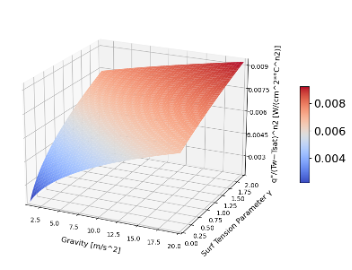

# Project Analysis: Predictive Genetic Algorithm Exploration

## Overview

This document provides a detailed analysis and summary of the project "Predictive Genetic Algorithm Exploration." The project explores the application of predictive genetic algorithms to model complex phenomena and optimize engineering systems. The study focuses on two main data sets: heat flux in nucleate boiling processes and the design and optimization of a heat pipe heat exchanger (HPHE) for electronic component cooling.

## Project Summary

### Objectives

The primary objectives of this project are:
1. To understand the influence of various parameters on heat flux in nucleate boiling processes.
2. To optimize the design and performance of a heat pipe heat exchanger (HPHE) using genetic algorithms.

### Data Sets

1. **Heat Flux in Nucleate Boiling Processes**:
   - Factors studied: gravitational acceleration, wall superheat, pressure, and surface tension.
   - Aim: To explore how these factors influence heat flux.

2. **Heat Pipe Heat Exchanger (HPHE)**:
   - Focus: Cooling electronic components within a cabinet.
   - Aim: To optimize the HPHE design for effective cooling.

### Tasks and Methodology

The project is divided into several tasks, each focusing on different aspects of the data analysis and model optimization.

#### Task 1: Heat Flux in Nucleate Boiling Processes

1. **Task 1.1: Initial Setup and Data Exploration**
   - Data visualization and statistical analysis.
   - Key visualizations include log-log plots and statistical summaries.

2. **Task 1.2: Machine Learning Analysis with Genetic Algorithms**
   - Optimization of model parameters using genetic algorithms.
   - Comparison of initial guesses and their impact on RMSE and MAE.

3. **Task 1.3: Expanding the Model and Surface Plot Creation**
   - Extension of the model to include additional parameters.
   - Generation of 3D surface plots to visualize the model behavior.

#### Task 2: Heat Pipe Heat Exchanger (HPHE)

1. **Task 2.1: Genetic Algorithm Implementation**
   - Separation of data into training and validation sets.
   - Optimization of algorithm parameters for the HPHE design.

2. **Task 2.2: Program Testing and Parameter Optimization**
   - Iterative testing and refinement of model parameters.
   - Analysis of training and validation results to ensure model accuracy.

## Results

### Key Findings

1. **Heat Flux in Nucleate Boiling Processes**:
   - Gravity has a notable impact on heat flux, particularly at higher levels.
   - The optimized predictive equation achieved a minimum absolute error (MAE) of 0.0288 and a root mean square error (RMSE) of 18.37.

2. **Heat Pipe Heat Exchanger (HPHE)**:
   - The optimized algorithm produced training set RMSE and MAE of 1.14 and 0.0164, respectively.
   - For the validation set, RMSE and MAE were 1.23 and 0.0216, respectively.

### Visualizations

#### Heat Flux vs. Wall Superheat

*Figure 3. Log-log plot of Heat Flux vs. Wall Superheat for two levels of gravity (0.098, 9.8, 19.6 m/s^2)*
(Located in Project Report, Section "Task 1.1", page 4)

#### Statistical Analysis

*Figure 4. Statistical analysis results using Python statsmodel library for data corresponding to earth and micro, and 2X gravity*
(Located in Project Report, Section "Task 1.1", page 4)

#### Initial Guesses Comparison
*Table 7. Top five initial guesses to achieve the lowest RMSE.*

*Table 8. Top five initial guesses to achieve the lowest MAE*

*Table 10. Best initial values and resultant minimum and average*

#### Surface Plot

*Figure 8. 3D surface plot from resulting curve-fit equation*
(Located in Project Report, Section "Task 1.3", page 7)

#### Training and Validation Data

*Figure 10. Training and validation data q' of predicted vs. data*
(Located in Project Report, Section "Task 2.2", page 8)

## Discussion

### Statistical Analysis and Model Performance

The project successfully demonstrated the application of genetic algorithms to optimize engineering models. The statistical analysis showed that gravity significantly affects heat flux, particularly at higher levels of gravitational acceleration. The genetic algorithms effectively minimized RMSE and MAE, highlighting the importance of initial guesses in the optimization process.

### Advantages and Limitations

#### Advantages
- **Versatility**: The predictive genetic algorithm is adaptable to various tasks and data sets.
- **Accuracy**: The optimized models achieved low RMSE and MAE, indicating high accuracy.

#### Limitations
- **Computational Intensity**: The optimization process, particularly with higher complexity models, requires significant computational resources.
- **Initial Guess Sensitivity**: The performance of genetic algorithms is highly dependent on the choice of initial guesses.

### Future Work

Future research could explore the following areas:
- **Enhanced Initial Guess Strategies**: Developing more sophisticated methods for generating initial guesses could improve optimization efficiency.
- **Hybrid Models**: Combining genetic algorithms with other machine learning techniques could further enhance model performance.
- **Real-time Optimization**: Implementing real-time optimization for dynamic systems could expand the practical applications of the genetic algorithms.

## Conclusion

The project "Predictive Genetic Algorithm Exploration" successfully applied genetic algorithms to model complex engineering systems. The findings underscore the importance of parameter optimization and provide valuable insights into the behavior of heat flux in nucleate boiling processes and the design of heat pipe heat exchangers. The methods and results presented in this study offer a robust foundation for future research and practical applications in engineering optimization.
