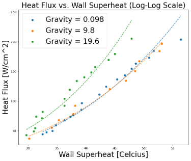
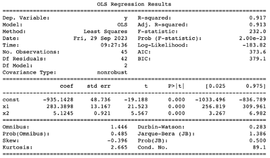
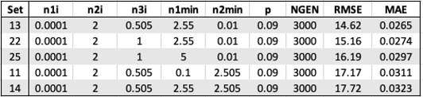
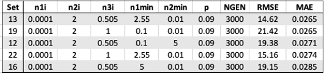
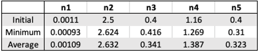
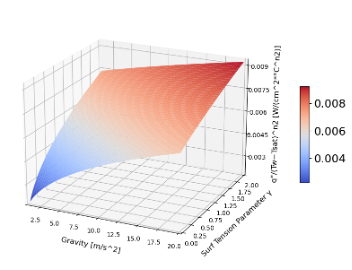
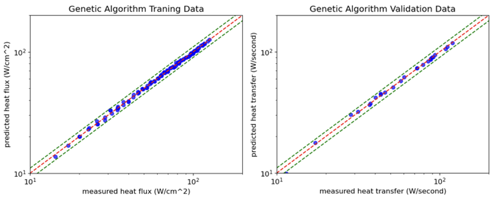

# Predictive Genetic Algorithm Exploration

This repository contains the project "Predictive Genetic Algorithm Exploration," which investigates the application of predictive genetic algorithms to understand complex phenomena and optimize engineering systems.

## Table of Contents
- [Introduction](#introduction)
- [Project Structure](#project-structure)
- [Installation and Setup](#installation-and-setup)
- [Usage](#usage)
- [Results](#results)
- [Contributors](#contributors)
- [License](#license)

## Introduction

This project explores the use of predictive genetic algorithms to model heat flux in nucleate boiling processes and to design and optimize a heat pipe heat exchanger (HPHE) for electronic component cooling. The project is structured into multiple tasks, including data exploration, machine learning analysis with genetic algorithms, and model expansion.

The analysis is structured into tasks:
1. Initial setup and data exploration
2. Machine learning analysis with genetic algorithms
3. Expanding the model and surface plot creation
4. Genetic algorithm implementation for HPHE
5. Program testing and parameter optimization

## Installation and Setup

To run the notebooks, you need to have Python and Jupyter Notebook installed. You can install the required packages using:

```bash
pip install -r requirements.txt
```

## Usage
You can run the notebooks in the notebooks/ directory to explore the data, implement genetic algorithms, and visualize the results.

## Results
**Heat Flux vs. Wall Superheat**



Figure 3. Log-log plot of Heat Flux vs. Wall Superheat for two levels of gravity (0.098, 9.8, 19.6 m/s^2)

**Statistical Analysis**



Figure 4. Statistical analysis results using Python statsmodel library for data corresponding to earth, micro, and 2X gravity

**Initial Guesses Comparison**

Table 7. Top five initial guesses to achieve the lowest RMSE.



Table 8. Top five initial guesses to achieve the lowest MAE



Table 10. Best initial values and resultant minimum and average



**Surface Plot**



Figure 8. 3D surface plot from resulting curve-fit equation

**Training and Validation Data**



Figure 10. Training and validation data q' of predicted vs. data

## Contributors
- Ali Rakhsha
- Daniel Garcia Mijares

## License
This project is licensed under the MIT License.
